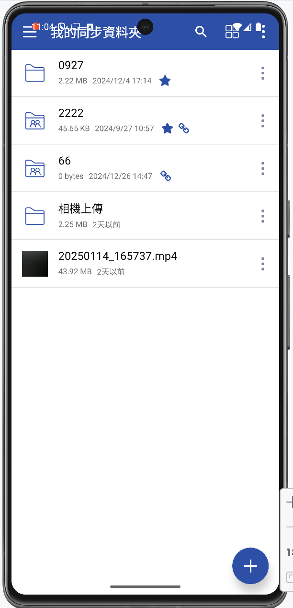
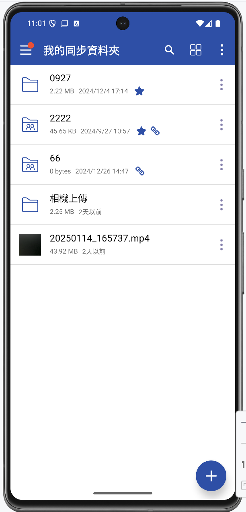

# StatusBarCustomizer

[](https://hits.seeyoufarm.com)

**StatusBarCustomizer** is a simple yet powerful solution for customizing the Android status bar. It allows you to easily apply solid color backgrounds while ensuring full compatibility across different Android versions. This project distinguishes between API levels, specifically addressing Android 15 (API 35) and above, which introduced borderless design, while maintaining seamless support for older versions.

## Features

- 🎨 **Customizable Status Bar Backgrounds**: Effortlessly apply solid color backgrounds to your Android status bar.
- 📱 **API Compatibility**: Supports both older Android versions (API <= 35) and the latest Android versions, providing adaptive solutions.
- 🛠️ **Padding Adjustments**: Automatically adjusts the status bar height to prevent layout issues and overlaps.

### Screenshots

Here is an example of the status bar customization on different Android versions:
<p align="center">
  
  
</p>

---

## About (English)

Starting from Android 15 (API 35), Google introduced a borderless design where the status bar and other system UI elements blend seamlessly with the content, which can negatively impact the layout of apps designed for older versions. You can address this by using the `android:fitsSystemWindows="true"` attribute, as mentioned in the [Android 15 Behavior Changes](https://developer.android.com/about/versions/15/behavior-changes-15) documentation. However, this method does not allow you to customize the status bar color, and it also affects older versions, preventing a consistent look across devices.

This project provides a solution by distinguishing between different API levels. It ensures that for Android 15 (API 35) and above, a status bar with a customizable color is added, while maintaining a consistent design across both new and older Android versions. This enables apps to achieve the same visual appearance across devices, regardless of the Android version.


## About (Chinese)

Android 15 （API 35）以上版本，開始採用無邊框設計，也就是說如果有些 App 的設計會因此受到影響。  
根據 [Android 15 行為變更](https://developer.android.com/about/versions/15/behavior-changes-15?hl=zh-tw) 文件，新增  `android:fitsSystemWindows="true"`  屬性能改善沒有 statusBar 的問題，但此方法無法讓你自定義狀態欄顏色，且它對舊版本仍有影響，無法在新舊版本中達到一致的視覺效果。

因此，本專案依照不同的 API 進行區分，在 Android 15 （API 35）以上版本中增加可自定義顏色的  statusBar，並提供一致的設計，無論是新舊版本皆可保持相同的視覺效果。


## How to Implement

This is how you can implement `StatusBarCustomizer`  in your Android application. The following method, `setStatusBarGradient`, handles status bar customization across different Android versions, applying a solid color or adjusting padding where necessary.

```java
public static void setStatusBar(Activity activity) {
    ColorDrawable background = new ColorDrawable(ContextCompat.getColor(activity, R.color.color_primary));

    if (Build.VERSION.SDK_INT <= Build.VERSION_CODES.UPSIDE_DOWN_CAKE) {
        // API 34 and below
        activity.getWindow().addFlags(WindowManager.LayoutParams.FLAG_DRAWS_SYSTEM_BAR_BACKGROUNDS);
        activity.getWindow().setStatusBarColor(ContextCompat.getColor(activity, android.R.color.transparent));
        activity.getWindow().setBackgroundDrawable(background);
    } else {
        // Set additional top padding for API 35 and above
        View decorView = activity.getWindow().getDecorView();
        decorView.setBackground(background);
        int statusBarHeight = getStatusBarHeight(activity);

        decorView.setPadding(
            decorView.getPaddingLeft(),
            statusBarHeight,
            decorView.getPaddingRight(),
            decorView.getPaddingBottom()
        );
    }
}

// Get Status Bar Height
private static int getStatusBarHeight(Context context) {
    int resourceId = context.getResources().getIdentifier("status_bar_height", "dimen", "android");
    if (resourceId > 0) {
        return context.getResources().getDimensionPixelSize(resourceId);
    }
    return 0;
}
```

---

## Other Methods

`<item name="android:fitsSystemWindows">true</item>`
- **Purpose**: Allows the status bar to be visible.

`<item name="android:windowDrawsSystemBarBackgrounds">true</item>`
- **Purpose**: This attribute enables the customization of the status bar and navigation bar backgrounds.

`<item name="android:windowTranslucentNavigation">false</item>`
- **Purpose**: This attribute controls the transparency of the navigation bar.

`<item name="android:statusBarColor">@color/transparent</item>` (I can't use this attribute to change my status bar.)
- **Purpose**: This attribute is used to set the status bar's color.

`<item name="android:navigationBarColor">@color/transparent</item>`
- **Purpose**: This attribute is used to customize the color of the navigation bar.

---

## Conclusion

Hope this helps you! 😊
